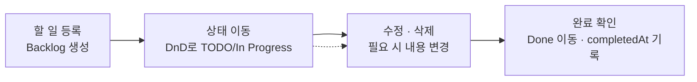

# PRD - Tika (Ticket-based Kanban Board)

| 항목 | 내용 |
|------|------|
| 문서명 | Product Requirements Document |
| 프로젝트 | Tika |
| 버전 | v0.1 (MVP) |
| 작성일 | 2026-08-05 |
| 관련 문서 | [TRD.md](./TRD.md) · [REQUIREMENTS.md](./REQUIREMENTS.md) · [API_SPEC.md](./API_SPEC.md) · [DATA_MODEL.md](./DATA_MODEL.md) · [COMPONENT_SPEC.md](./COMPONENT_SPEC.md) · [TEST_CASES.md](./TEST_CASES.md) |

---

## 1. 제품 개요

Tika는 **티켓 기반 칸반 보드 TODO 앱**이다. 사용자는 할 일을 "티켓" 단위로 등록하고, 칸반 보드의 컬럼 사이를 드래그 앤 드롭으로 이동시키며 작업 상태를 관리한다.

- 개인이 자신의 작업을 시각적으로 추적할 수 있는 가벼운 칸반 도구를 목표로 한다.
- 복잡한 협업 기능(멀티유저, 코멘트 등) 없이, **티켓 생성 → 상태 이동 → 완료**라는 핵심 흐름에 집중한다.
- 각 티켓은 계획/실제 시작일과 계획/실제 종료일을 가져, 일정 관리와 지연(overdue) 여부 파악이 가능하다.

## 2. MVP 범위

MVP는 아래 범위로 한정한다.

| 구분 | 내용 |
|------|------|
| 사용자 | 단일 사용자 (로그인/인증 없음, 별도 사용자 구분 없음) |
| 컬럼 구성 | 고정 4컬럼 — **Backlog / TODO / In Progress / Done** (사용자 정의·추가·삭제 불가) |
| 티켓 CRUD | 생성(Create), 조회(Read), 수정(Update), 삭제(Delete) |
| 이동 방식 | 드래그 앤 드롭(@dnd-kit)으로 컬럼 간·컬럼 내 순서 이동 |
| 날짜 필드 | 계획시작일(plannedStartDate), 시작일(startedAt), 계획종료일(plannedEndDate), 종료일(completedAt) |

날짜 필드 4종은 다음과 같이 동작한다.

- **계획시작일 / 계획종료일**: 티켓 생성·수정 시 사용자가 직접 입력하는 목표 일정
- **시작일**: 티켓이 TODO/In Progress로 처음 이동할 때(작업 착수 시점) 시스템이 자동 기록
- **종료일**: 티켓이 Done으로 이동할 때 시스템이 자동 기록 (completedAt)

## 3. 2차 스펙 (MVP 제외 범위)

아래 항목은 MVP에서 **명시적으로 제외**하며, 구현하지 않는다.

| 제외 항목 | 사유 |
|-----------|------|
| 인증 (로그인/회원가입) | 단일 사용자 전제이므로 MVP 불필요 |
| 커스텀 컬럼 (추가/이름변경/삭제/순서변경) | 고정 4컬럼 구조로 MVP 범위 확정 |
| 멀티 사용자 (사용자 초대, 권한, 담당자 지정) | 협업 기능은 2차 스펙 |
| 라벨 / 코멘트 | 티켓 부가 정보 기능은 2차 스펙 |
| 파일 업로드 (첨부파일, 이미지) | 스토리지 연동이 필요한 기능은 2차 스펙 |

> CLAUDE.md 원칙에 따라 명세에 없는 기능은 임의로 추가하지 않는다. 위 항목이 구현 중 필요해 보이더라도 별도 요청 없이 구현하지 않는다.

## 4. 사용자 시나리오

**시나리오: 할 일 등록부터 완료까지**

1. **할 일 등록**: 사용자가 "+ 티켓 생성" 버튼을 눌러 제목, 설명, 우선순위, 계획시작일, 계획종료일을 입력하고 저장한다. 티켓은 Backlog 컬럼 최상단에 생성된다.
2. **상태 이동**: 사용자가 작업을 시작하면 티켓 카드를 드래그해 TODO 또는 In Progress 컬럼으로 이동시킨다. 이때 시작일(startedAt)이 자동 기록된다.
3. **수정/삭제**: 작업 도중 계획이 바뀌면 티켓 카드를 클릭해 상세 모달을 열고 내용을 수정한다. 더 이상 필요 없는 티켓은 확인 다이얼로그를 거쳐 삭제한다.
4. **완료 확인**: 작업이 끝나면 티켓을 Done 컬럼으로 드래그한다. 종료일(completedAt)이 자동 기록되고, 보드에서 완료된 티켓을 시각적으로 확인할 수 있다. Done 진입 24시간 경과 시 보드 조회에서 자동 제외된다.



## 5. 핵심 기능 목록 (FR-001 ~ FR-008)

아래 기능은 [REQUIREMENTS.md](./REQUIREMENTS.md)에 동일한 ID로 상세 정의된다.

| ID | 기능 | 설명 |
|----|------|------|
| FR-001 | 티켓 생성 | 제목, 설명, 우선순위, 계획시작일, 계획종료일을 입력해 티켓을 생성한다. 신규 티켓은 Backlog 컬럼 최상단에 배치된다. |
| FR-002 | 보드 조회 | 전체 티켓을 4개 컬럼(Backlog/TODO/In Progress/Done)별로 그룹화하여 조회하며, 각 컬럼 내에서는 position 오름차순으로 정렬한다. |
| FR-003 | 티켓 상세 | 보드에서 카드를 클릭하면 모달로 티켓의 전체 정보(제목, 설명, 우선순위, 4종 날짜, 상태)를 표시한다. |
| FR-004 | 티켓 수정 | 상세 모달에서 제목, 설명, 우선순위, 계획시작일, 계획종료일을 수정할 수 있다. |
| FR-005 | 티켓 완료 | 티켓이 Done 컬럼으로 이동하면 종료일(completedAt)이 자동 설정된다. Done 진입 후 24시간이 경과한 티켓은 보드 조회에서 자동 제외된다. |
| FR-006 | 티켓 삭제 | 삭제 시 확인 다이얼로그를 거친 뒤 티켓을 영구 삭제한다. |
| FR-007 | 드래그 앤 드롭 | 컬럼 간 이동 및 컬럼 내 순서 변경을 지원한다. TODO/In Progress 최초 진입 시 시작일(startedAt), Done 진입 시 종료일(completedAt)을 자동 관리한다. |
| FR-008 | 오버듀(지연) 판정 | 계획종료일이 지났음에도 미완료(Done이 아닌) 상태인 티켓에 시각적 경고(예: 붉은색 배지)를 표시한다. |

## 6. 기술 스택 요약

CLAUDE.md에 정의된 기술 스택과 선정 이유는 다음과 같다.

| 영역 | 기술 | 선정 이유 |
|------|------|-----------|
| 프레임워크 | Next.js 15 (App Router) | 프론트엔드(페이지/컴포넌트)와 백엔드(Route Handlers)를 하나의 프로젝트에서 디렉토리 수준으로 분리하면서도, 단일 배포 파이프라인(Vercel)으로 운영 가능 |
| 언어 | TypeScript (strict mode) | `any` 금지, 공유 타입(src/shared) 기반 프론트/백엔드 계약을 컴파일 타임에 강제해 런타임 오류 최소화 |
| 프론트엔드 | React 19 | Next.js App Router의 표준 UI 라이브러리, 함수 컴포넌트 기반 개발과 동시성 렌더링 지원 |
| 스타일링 | Tailwind CSS 4 | 유틸리티 클래스 기반으로 칸반 보드처럼 반복되는 카드/컬럼 UI를 빠르게 일관성 있게 구현 |
| 드래그 앤 드롭 | @dnd-kit/core + @dnd-kit/sortable | 접근성(A11y)을 기본 지원하는 React 전용 DnD 라이브러리로, 칼럼 간 이동과 컬럼 내 정렬(sortable)을 모두 처리 |
| ORM | Drizzle ORM | 타입 안전한 쿼리 빌더로 raw SQL 없이 스키마-쿼리 간 타입을 일치시켜 데이터 모델 변경 시 컴파일 타임에 오류를 검출 |
| DB | Vercel Postgres (Neon) | Next.js/Vercel 배포 환경과 통합된 서버리스 Postgres로 별도 인프라 구축 없이 운영 가능 |
| 검증 | Zod | src/shared/validations에서 프론트(폼)와 백엔드(API 요청) 검증 스키마를 하나로 공유해 검증 로직 중복 제거 |
| 테스트 | Jest + React Testing Library | TDD 사이클(Red-Green-Refactor)에 필요한 단위/컴포넌트 테스트를 지원하며 Next.js와의 통합 구성이 표준화되어 있음 |
| 배포 | Vercel | Next.js 제작사의 플랫폼으로 App Router, Postgres, 서버리스 함수가 별도 설정 없이 통합 배포됨 |

## 7. 와이어프레임 참고

보드 레이아웃은 **좌측 Backlog 사이드바 + 우측 3컬럼(TODO/In Progress/Done) 보드**의 Swimlane 구조를 따른다. Backlog는 별도 착수 전 대기열로 시각적으로 분리하고, 실제 진행 중인 작업 흐름(TODO → In Progress → Done)을 오른쪽에 나란히 배치해 진행 상태에 집중할 수 있도록 한다.

```
┌───────────────┬──────────────────────────────────────────────────────────────────┐
│   Backlog     │                        Board (Swimlane)                          │
│  (사이드바)    ├───────────────┬───────────────────┬───────────────────────────────┤
│               │     TODO      │   In Progress      │            Done              │
│ [+ 티켓 생성]  │               │                    │                               │
│               │               │                    │                               │
│ ┌───────────┐ │ ┌───────────┐ │ ┌───────────┐      │ ┌───────────┐                 │
│ │ Ticket #1 │ │ │ Ticket #4 │ │ │ Ticket #6 │      │ │ Ticket #8 │  (24h 후 자동 제외)│
│ └───────────┘ │ └───────────┘ │ └───────────┘      │ └───────────┘                 │
│ ┌───────────┐ │ ┌───────────┐ │ ┌───────────┐      │                               │
│ │ Ticket #2 │ │ │ Ticket #5 │ │ │ Ticket #7 │      │                               │
│ └───────────┘ │ └───────────┘ │ └───────────┘      │                               │
│ ┌───────────┐ │               │  ⚠ 오버듀 배지     │                               │
│ │ Ticket #3 │ │               │  (계획종료일 초과) │                               │
│ └───────────┘ │               │                    │                               │
└───────────────┴───────────────┴────────────────────┴───────────────────────────────┘
      드래그 →       칼럼 간 드래그 앤 드롭으로 이동 (@dnd-kit)          → 드래그
```

- **Backlog 사이드바**: 착수 전 티켓 대기열. 티켓 생성 버튼이 위치하며, 신규 티켓은 이 목록 최상단에 추가된다(FR-001).
- **우측 3컬럼 보드**: 실제 작업 흐름을 나타내는 Swimlane. 컬럼 간 드래그 앤 드롭 시 FR-007에 따라 startedAt/completedAt이 자동 관리된다.
- **오버듀 배지**: In Progress/TODO 카드 중 계획종료일이 지난 티켓에 시각적 경고 표시 (FR-008).
- 상세 컴포넌트 구조 및 Props는 [COMPONENT_SPEC.md](./COMPONENT_SPEC.md)에서 정의한다.
