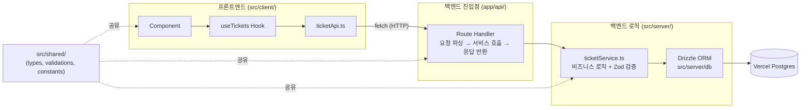
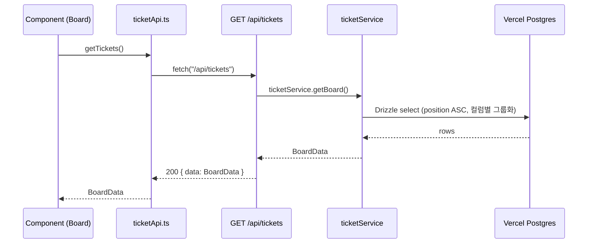
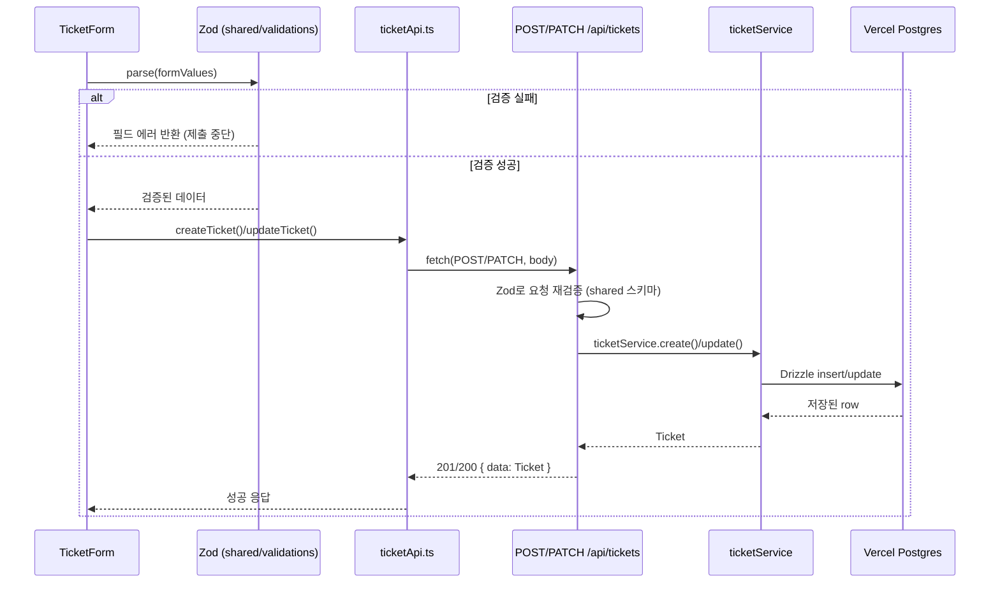
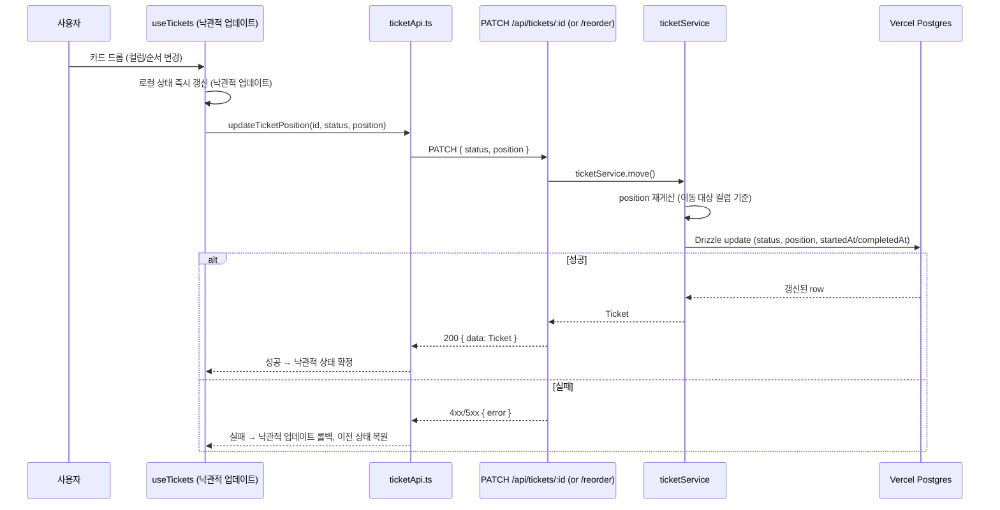

# TRD - Tika (Ticket-based Kanban Board)

| 항목 | 내용 |
|------|------|
| 문서명 | Technical Requirements Document |
| 프로젝트 | Tika |
| 버전 | v0.1 (MVP) |
| 작성일 | 2026-08-05 |
| 관련 문서 | [PRD.md](./PRD.md) · [REQUIREMENTS.md](./REQUIREMENTS.md) · [API_SPEC.md](./API_SPEC.md) · [DATA_MODEL.md](./DATA_MODEL.md) · [COMPONENT_SPEC.md](./COMPONENT_SPEC.md) · [TEST_CASES.md](./TEST_CASES.md) |

---

## 1. 시스템 아키텍처

### 1.1 전체 구조

Tika는 **Vercel 단일 배포** 구조를 사용한다. Next.js App Router 하나의 프로젝트 안에서 프론트엔드(페이지·컴포넌트)와 백엔드(Route Handlers)를 함께 관리하되, `app/api/`와 `src/server/`, `src/client/`를 디렉토리 수준에서 엄격히 분리한다. 별도의 백엔드 서버나 인프라 없이, Vercel이 프론트엔드 정적/서버 렌더링과 API Route를 서버리스 함수로 함께 배포·운영한다.

```
                    Vercel (단일 배포)
┌─────────────────────────────────────────────────┐
│                                                   │
│   Next.js App Router                             │
│   ┌───────────────────┐   ┌───────────────────┐  │
│   │  프론트엔드         │   │  API Routes        │  │
│   │  (React 19 SSR/CSR)│──▶│  (Serverless Fn)   │  │
│   └───────────────────┘   └─────────┬─────────┘  │
│                                      │            │
└──────────────────────────────────────┼────────────┘
                                       ▼
                          ┌────────────────────────┐
                          │  Vercel Postgres (Neon)  │
                          │  서버리스 커넥션 풀       │
                          └────────────────────────┘
```

### 1.2 아키텍처 다이어그램 (요청 처리 흐름)

모든 요청은 아래 4단계 계층을 순서대로 통과한다. 각 계층은 자신의 바로 아래 계층만 호출하며, 계층을 건너뛰지 않는다.



- **Component → Route Handler**: HTTP 통신(fetch)만 허용. 프론트엔드는 `src/server/`의 어떤 코드도 직접 import하지 않는다.
- **Route Handler → Service**: 함수 호출. Route Handler는 요청 파싱과 응답 변환만 담당하고 비즈니스 로직을 갖지 않는다.
- **Service → Drizzle → DB**: 모든 DB 접근은 Drizzle ORM을 통해서만 이루어지며, raw SQL은 작성하지 않는다.
- **src/shared/**: 타입(Ticket, BoardData 등)과 Zod 스키마, 상수를 프론트/백엔드 양쪽에서 동일하게 참조해 계약을 일치시킨다.

### 1.3 디렉터리 구조

```
tika/
├── app/
│   ├── api/                          # 백엔드 진입점 — 요청 파싱 + 응답만
│   │   └── tickets/
│   │       ├── route.ts              # GET, POST /api/tickets
│   │       ├── [id]/
│   │       │   ├── route.ts          # GET, PATCH, DELETE /api/tickets/:id
│   │       │   └── complete/route.ts # PATCH /api/tickets/:id/complete
│   │       └── reorder/route.ts      # PATCH /api/tickets/reorder
│   ├── (board)/
│   │   ├── page.tsx                  # 메인 칸반 보드 페이지
│   │   └── layout.tsx
│   └── layout.tsx
│
├── src/
│   ├── server/                       # 백엔드 로직 (services, db, middleware)
│   │   ├── services/ticketService.ts
│   │   ├── db/{index,schema,seed}.ts
│   │   └── middleware/{errorHandler,validate}.ts
│   │
│   ├── client/                       # 프론트엔드 로직 (components, hooks, api)
│   │   ├── components/{board,ticket,ui}/
│   │   ├── hooks/useTickets.ts
│   │   └── api/ticketApi.ts          # 프론트 API 호출은 이 파일을 통해서만
│   │
│   └── shared/                       # 공유 타입, Zod 스키마, 상수
│       ├── types/index.ts
│       ├── validations/ticket.ts
│       └── constants.ts
│
├── __tests__/                        # Jest + RTL 테스트
└── docs/                             # 프로젝트 명세 문서
```

## 2. 기술 스택 상세

| 영역 | 기술 | 버전 | 선정 이유 | 주요 대안 비교 |
|------|------|------|-----------|----------------|
| 프레임워크 | Next.js (App Router) | 15.x | 프론트/백엔드를 한 프로젝트에서 디렉토리 수준으로 분리하면서 단일 배포 가능. Route Handler가 곧 API 서버 역할을 하여 별도 백엔드 인프라 불필요 | **Express/NestJS 분리 구성**: 배포 단위가 2개로 늘고 CORS·인증 토큰 관리 등 부가 복잡도 발생 → MVP 단일 사용자 규모에 과함 |
| 런타임 | Node.js (Vercel Serverless Functions) | Vercel 관리 버전 (Node 20.x LTS) | Route Handler가 요청 단위로 격리된 서버리스 함수로 실행되어 별도 서버 프로세스 운영·스케일링 불필요 | **Edge Runtime**: Drizzle의 Postgres 드라이버 및 일부 Node API(커넥션 풀) 호환성 제약 → 서버리스 Node 런타임 채택 |
| 언어 | TypeScript (strict) | 5.x | `any` 금지 원칙 하에 src/shared 타입을 프론트/백엔드가 컴파일 타임에 강제 공유 | **JavaScript**: 런타임까지 타입 오류를 발견 못해 프론트-백엔드 계약 불일치 위험 → 제외 |
| 프론트엔드 | React | 19.x | Next.js App Router 표준 UI 라이브러리, 함수 컴포넌트 기반 | — (Next.js와 결합, 대안 검토 불필요) |
| 스타일링 | Tailwind CSS | 4.x | 칸반 카드/컬럼처럼 반복되는 UI를 유틸리티 클래스로 빠르게 일관성 있게 구현, 별도 CSS 파일 관리 부담 감소 | **CSS Modules / styled-components**: 컴포넌트별 파일 분산 및 런타임 CSS-in-JS 오버헤드 → 유틸리티 우선 접근 채택 |
| 드래그 앤 드롭 | @dnd-kit/core, /sortable | core 6.x / sortable 8.x | React 전용, 접근성(키보드 조작) 기본 지원, 컬럼 간 이동과 컬럼 내 정렬(sortable)을 하나의 라이브러리로 처리 | **react-beautiful-dnd**: 유지보수 중단(deprecated), React 18+ Strict Mode 호환성 이슈 → 제외 |
| ORM | Drizzle ORM | 0.38.x | Vercel Postgres 공식 지원 드라이버 제공, 코드 생성(generate) 단계 없이 스키마 파일 자체가 타입 소스, SQL에 가까운 쿼리 빌더로 러닝커브가 낮음 | **Prisma**: 스키마 변경 시 `prisma generate` 코드 생성 단계가 필수라 서버리스 콜드스타트/CI 빌드 시간 증가, 별도 엔진 바이너리 번들링 필요 → Drizzle이 서버리스 환경에 더 적합 |
| DB | Vercel Postgres (Neon 기반) | — | Neon 기반 서버리스 Postgres로 커넥션 풀을 자동 관리해 서버리스 함수의 짧은 생명주기와 궁합이 좋음. Vercel 배포와 환경 변수 연동이 기본 통합됨 | **PlanetScale(MySQL)/Supabase**: Drizzle 호환은 가능하나 Vercel 네이티브 통합(자동 환경 변수 주입, 대시보드 연동) 부재 → Vercel Postgres 채택 |
| 검증 | Zod | 3.x | src/shared/validations의 스키마 하나를 프론트(폼)와 백엔드(API 요청)가 함께 사용해 검증 로직 중복 제거, TypeScript 타입 자동 추론(`z.infer`) | **Yup/Joi**: TypeScript 타입 자동 추론이 약하거나 별도 타입 정의 필요 → Zod가 shared 타입 전략과 가장 잘 맞음 |
| 테스트 | Jest + React Testing Library | latest | TDD Red-Green-Refactor 사이클에 필요한 단위/컴포넌트 테스트 지원, Next.js 공식 문서의 표준 테스트 구성 | **Vitest**: 성능 이점은 있으나 Next.js/RTL 생태계 문서·예제가 Jest 기준으로 더 풍부 → Jest 채택 |
| 배포 | Vercel | — | Next.js 제작사 플랫폼으로 App Router, Postgres, 서버리스 함수, 환경 변수가 별도 설정 없이 통합 | — (Next.js 15 + Vercel Postgres 조합의 자연스러운 귀결) |

> 위 표는 [PRD.md](./PRD.md) 6장 "기술 스택 요약"과 항목·버전이 일치하며, TRD는 각 선택의 대안 비교를 추가로 제공한다.

## 3. 데이터 흐름

### 3.1 읽기 흐름 (보드 조회 — FR-002)



### 3.2 쓰기 흐름 (티켓 생성/수정 — FR-001, FR-004)



- 폼 제출 시 프론트에서 1차 Zod 검증(즉시 UX 피드백), Route Handler에서 동일 스키마로 2차 검증(신뢰 경계). 두 곳 모두 `src/shared/validations`의 **동일한** 스키마를 import한다.

### 3.3 드래그 앤 드롭 흐름 (FR-007)



- UI는 서버 응답을 기다리지 않고 즉시 카드를 이동시켜 체감 지연을 없앤다(낙관적 업데이트).
- 서버는 position을 클라이언트 값 그대로 신뢰하지 않고, 이동 대상 컬럼 내 순서를 기준으로 재계산한다.
- Done 컬럼으로 이동 시 completedAt, TODO/In Progress 최초 진입 시 startedAt을 서비스 계층에서 자동 설정한다(FR-005, FR-007).
- 요청 실패 시 훅은 낙관적 업데이트를 롤백해 서버 상태와 불일치가 남지 않도록 한다.

## 4. 계층 간 경계 규칙

CLAUDE.md의 경계 규칙을 기술적으로 강제한다.

| 규칙 | 내용 |
|------|------|
| `src/server/` ↔ `src/client/` 상호 import 금지 | 백엔드 작업 시 프론트엔드 코드 수정 금지, 프론트엔드 작업 시 백엔드 코드 수정 금지. ESLint import 경계 규칙으로 위반 시 빌드 실패 처리 |
| `src/shared/`만 양쪽에서 참조 가능 | 타입(types), Zod 스키마(validations), 상수(constants)만 공유. 양쪽에 영향을 주는 변경은 src/shared/ 먼저 수정 후 각각 반영 |
| Route Handler는 얇게 유지 | `app/api/**/route.ts`는 요청 파싱 → `src/server/services/*` 호출 → 응답 반환만 수행. 비즈니스 로직·DB 쿼리를 Route Handler에 직접 작성하지 않는다 |
| DB 접근은 Service 계층 + Drizzle로 한정 | Route Handler, 컴포넌트 어디에서도 `src/server/db`를 직접 호출하지 않고 반드시 `ticketService`를 경유한다. raw SQL 금지 |
| 프론트 API 호출 단일 창구 | 컴포넌트/훅은 `fetch`를 직접 호출하지 않고 `src/client/api/ticketApi.ts`를 통해서만 백엔드와 통신한다 |

## 5. 개발 환경 설정

| 항목 | 내용 |
|------|------|
| 로컬 DB 연결 | `vercel env pull .env.local` 로 Vercel Postgres 접속 환경 변수(`POSTGRES_URL` 등)를 로컬로 가져온다. 로컬 전용 Postgres를 쓰는 경우 `.env.local`에 `POSTGRES_URL`을 직접 설정 |
| DB 마이그레이션 | Drizzle Kit으로 `db:generate`(마이그레이션 파일 생성) → `db:migrate`(적용). 스키마 소스는 `src/server/db/schema.ts` 하나 |
| 테스트 | Jest + React Testing Library. `__tests__/{api,services,components,hooks}`로 계층별 분리. TDD 사이클(Red→Green→Refactor)에 따라 TEST_CASES.md의 케이스를 먼저 작성 |
| Lint | ESLint (TypeScript strict, import 경계 규칙 포함) |
| 포맷팅 | Prettier로 코드 스타일 통일, 커밋 전 포맷팅 적용 |
| 로컬 실행 | `npm install` → `.env.local` 설정 → `npm run db:migrate` → (선택) `npm run db:seed` → `npm run dev` |

## 6. 배포 전략

| 항목 | 내용 |
|------|------|
| 프로덕션 배포 | `main` 브랜치 push 시 Vercel이 자동으로 빌드·배포 (Git 연동 기반 CI/CD, 별도 배포 스크립트 불필요) |
| Preview 배포 | PR 생성 시 Vercel이 해당 브랜치 전용 Preview URL을 자동 생성해 리뷰어가 실제 동작을 확인 가능. PR에 커밋 push마다 갱신 |
| 환경 변수 관리 | `POSTGRES_URL` 등 민감 값은 코드/`.env` 커밋 없이 **Vercel Dashboard**의 Environment Variables에서 Production/Preview/Development 스코프별로 관리 |
| 롤백 | Vercel Dashboard에서 이전 배포(Deployment)를 즉시 프로모트해 롤백 가능 (별도 배포 파이프라인 수정 불필요) |
| DB 마이그레이션 배포 | 스키마 변경 시 배포 전 `db:migrate`를 별도로 실행해 Vercel Postgres에 반영 (앱 배포와 마이그레이션 적용을 분리해 위험 최소화) |

## 7. PRD 정합성 확인

- **기능 목록**: 본 문서 3장의 데이터 흐름 예시(읽기=FR-002, 쓰기=FR-001/FR-004, DnD=FR-007)는 [PRD.md](./PRD.md) 5장의 FR-001~FR-008과 ID 기준으로 정확히 대응한다. 완료(FR-005), 오버듀 판정(FR-008)은 3.3절의 Service 계층 로직(completedAt 자동 설정, position 재계산 시점)에서 함께 처리된다.
- **기술 스택**: 본 문서 2장의 표는 PRD.md 6장과 동일한 8개 항목(프레임워크/런타임·언어/프론트엔드/스타일링/DnD/ORM/DB/검증/테스트/배포)을 다루며 버전 표기가 일치한다. TRD는 여기에 런타임(Node.js/Vercel Serverless) 항목과 각 기술의 대안 비교를 추가로 포함해 PRD의 "선정 이유"를 기술적으로 보강한다.
- **디렉터리 구조**: 본 문서 1.3절은 README.md의 프로젝트 구조 및 CLAUDE.md의 경계 규칙(app/api/, src/server/, src/client/, src/shared/)과 동일한 4분할 구조를 따른다.
